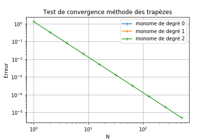
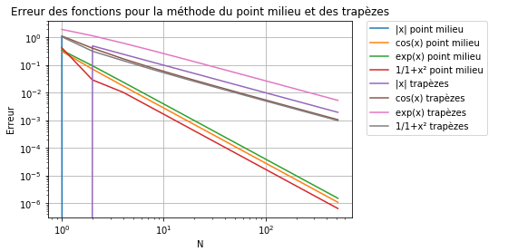

# Première initiation à git, python, markdown en programmant des formules de quadrature en python

## Introduction
Ce fichier fait en même temps office d'énoncé du travail et de compte
rendu. Il doit donc être complété au cours de la séance, au fur et à
mesure que vous réalisez le travail. Les modifications de ce fichier
[./README.md](./README.md) et des fichiers modifiés et ajoutés par
exemple dans les répertoires [./src](./src) ou [./img](./img) doivent
donc être décrit dans l'historique du dépôt git, à travers une série de
*commit* les plus simples possible (dits *atomiques*).

Ce fichier est rédigé, et doit être complété en utilisant le formatage
*markdown*.

Ce travail me permet d'évaluer
- vos capacités initiales de programmation en python
- votre capacité à utiliser un document mathématique pour réaliser un
  programme
- votre capacité à apprendre un nouveau formalisme (*python* et surtout *markdown*)
- vos compétences techniques relatives à l'utilisation de git
- vos capacités à documenter avec un niveau de détail adapté votre
  travail. 

*Il n'est pas nécessaire d'aller au bout des questions de programmation
(le niveau de départ en programmation au sein du groupe est très
hétérogène), l'essentiel est que j'ai la possibilité de comprendre quels
sont vos acquis sur les points ci-dessus.*

**À la fin de votre travail, il est donc capital de pousser (*git push*)
  vos modifications sur le serveur, afin que je puisse les voir**

## Avant de commencer
* prenre connaissance, brièvement, du [langage
Markdown](https://guides.github.com/features/mastering-markdown) propre
à la plateforme Github.

Si vous lisez ceci, c'est que vous avez:

- un compte sur la plateforme github.com, et un email validé de
  l'Université (IDNum)

- utilisé le lien déposé sur moodle, et accepté la création automatique
  d'un dépôt git contenant ce répertoire de travail.

## Première partie: environnement de travail et initiation à Python

1. Une fois le dépôt créé, vous le voyez sur votre compte github (en
ligne). Vous pouvez donc récupérer l'adresse et commencer à travailler
(*git clone <url à récupérer en ligne>*).

2. N'oubliez pas de configurer git si nécessaire: *git config --list,
git config --local user.{name,email}* pour regler vos identifiant et
adresse email..

3. Préparez votre environnement de travail: éditeur de texte (*emacs*,
*vim*, *atom*...) et terminaux (terminal par défaut du système, pour git
et pour l'interpréteur *ipython3*), ou bien environnement de
développement intégré (comme *spyder3* ou *pycharm*). 

Détaillez ci-dessous votre choix d'environnement de travail et les
raisons de ce choix.

*J'ai choisi d'utiliser spyder3 pour effectuer le tp car c'est un logiciel que j'ai l'habitude d'utiliser pour coder en python depuis l'an dernier*

4. Puisque vous avez apporté des modifications cohérentes (réponse à la
question 3. ci-dessus), validez ces modifications (*git add* et *git
commit -m "..."*).

5. Familiarisez vous avec le contenu du répertoire, qui devrait
ressembler à :
    
```
├── README.md
├── img
│   └── test_1.png
├── src
│   ├── fonctions_test.py
│   ├── quadratures.py
│   └── tests.py
└── tex
    ├── memo_quadratures.pdf
    ├── memo_quadratures.tex
```

Quel est la nature (langage ?) et le rôle (texte, programme, autre) de
chacun des fichiers présents ?

*1.Le rôle du fichier README.md est de décrire la nature des divers fichiers accessibles à l'utilisateur, il est écrit en Markdown

2.test_1.png est un graphique représentant la convergence de la méthode du point milieu en fonction du degré du monôme, l'image est donnée par un code en python

3.fonction_test.py est un code en python qui définit des fonctions vérifiant la précision et l'ordre de convergeance des formules de quadratures

4.quadratures.py est un code en python donnant la quadrature de f par la méthode du point milieu

5.test.py est un code en python qui compare l'application des méthodes précédentes sur l'intervalle [0;1] de différents monômes. Le code créer ensuite l'image test_1.png pour comparer la convergence.

6.memo_quadratures.tex en est fichier écrit en LaTeX qui explique les propriétés des divers formules de quadratures

7.memo_quadratures.pdf est la version pdf du fichier précédent.*

**Pensez à valider régulièrement votre travail, et à pousser les
  changements sur le serveur (*git push*) de temps en temps et surtout à
  la fin de la séance de travail**

## Deuxième partie: formules de quadrature

### Exemple: brève analyse de l'ordre de la formule du point milieu
Le programme fournit permet de tester la formule du point milieu sur les
monomes (puissance 0, 1, 2). Les résultats obtenus sont donnés dans le
tableau et le graphe ci-dessous:

n   | erreur x^0 | erreur x^1 | erreur x^2
--- | ---------- | ---------- | ----------
1   |          0 |          0 | 8.333e-02
2   |          0 |          0 | 2.083e-02
4   |          0 |          0 | 51208e-03
8   |          0 |          0 | 1.302e-03
16  |          0 |          0 | 3.255e-04
32  |          0 |          0 | 8.138e-05
64  |          0 |          0 | 2.035e-05
128 |          0 |          0 | 5.086e-06
256 |          0 |          0 | 1.272e-06
512 |          0 |          0 | 3.179e-07


L'erreur est nulle pour l'intégration des fonctions $x^0$ et $x^1$ car
la formule utilisée est exacte pour les polynômes jusqu'au degré 1. La
courbe ne s'affiche donc pas (en échelle logarithmique, $0$ est à
$-\infty$). 

Pour la fonction $x^2$, on voit que l'erreur décroit proportionnellement
à $1/n^2$: elle est divisée par 4 à chaque fois que $n$ est multiplié
par 2 (dans le tableau) ou encore est divisée par 10^2 chaque fois que
$n$ est multiplié par 10 (visible sur le graphe). C'est cohérent avec la
théorie pour une formule composée d'ordre 1.

### Programmation et analyse d'autres formules

1. En suivant le modèle de la formule du point milieu, dans le fichier
[./src/quadratures.py](./src/quadratures.py) programmer la méthode des
trapèzes (programmer une autre fonction dans le même fichier
[./src/quadratures.py](./src/quadratures.py)).

2. Tester cette nouvelle quadrature en utilisant comme modèle le
programme [./src/tests.py](./src/tests.py): vérifier que cette formule
calcul de manière exacte les intégrales de polynomes de degré au plus 1,
et commet une erreur équivalente à $h^2$ (ou encore
$N^{-2}$). Reproduire ci-dessous les tableaux d'erreurs qui démontrent
ce résultat, et inclure le graphe de convergence des approximations.




3. On veut tester nos formules pour d'autres fonctions que les
polynômes. Pour cela, on ajoute les fonctions souhaitées dans le fichier
[./src/fonctions_test.py](./src/fonctions_test.py). En suivant le modèle
donné pour les monomes, programmer les fonctions, et une de leurs
primitives
 - $f(x) = |x|$ et $g(x) = 0.5*x*|x|$;
 - $f(x) = cos(x)$ et $g(x) = sin(x)$;
 - $f(x) = exp(x)$ et $g(x) = exp(x)$;
 - $f(x) = 1/(1+x^2)$ et $g(x) = atan(x)$.

4. Produire une unique figure qui compare les graphes de convergence de
l'erreur pour ces nouvelles fonctions integrées sur l'intervalle
$[-1,1]$ avec les méthodes du point milieu et des trapèzes. Insérez
l'image ci-dessous, et faites tous les commentaires utiles.



On remarque une variation de pente entre les deux méthodes, la méthode du point milieu converge plus vite que celle des trapèzes
Pour plus de précision, donnez un tableau comparatif des erreurs commise
pour chacune de ces fonctions pour les deux méthodes.

5. Programmez maintenant la méthode de Simpson et les méthodes de
Gauss-Legendre à 2 et 3 points (voir le document
[./tex/memo_quadratures.pdf](./tex/memo_quadratures.pdf)). 

  1. Expliquez la stratégie de programmation retenue.
  
  2. Vérifiez numériquement que les formules intègrent exactement les
polynomes de degré au plus 3 (Simpson, Gauss-Legendre à 2 points) ou 5
(Gauss-Legendre à 3 points).
  
  3. Calculez numériquement l'ordre de convergence de ces méthodes
     (graphes et tableaux).

6. On peut maintenant comparer l'ensemble des méthodes programmées, pour
chacune des fonctions de la question 3. Produisez les tableaux et
graphes d'erreurs que vous jugez utilse et discutez les résultats
obtenus.

**N'oubliez pas de valider les modifications faites le plus souvent
possible (*validations atomiques*), et de documenter intelligiblement
l'historique associé (les messages). Finalement, n'oubliez pas de
pousser votre travail sur le dépôt.**